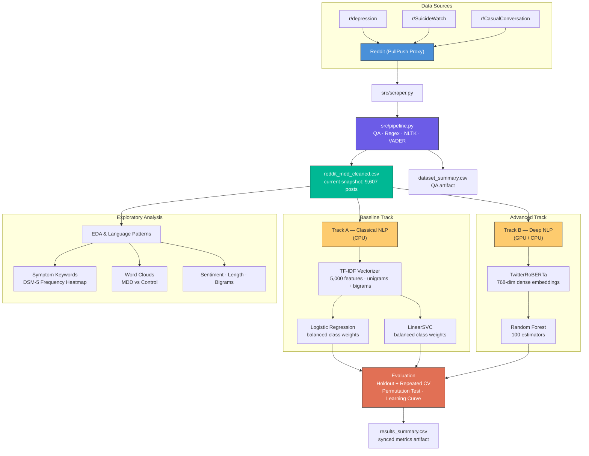

<div align="center">

# Reddit MDD NLP Corpus

**Natural Language Processing of Social Media for Major Depressive Disorder Symptom Identification**

[](https://python.org)
[](https://pytorch.org)
[](https://huggingface.co/cardiffnlp/twitter-roberta-base)
[](https://scikit-learn.org)
[](LICENSE)

*Big Data Analytics (BDA) · 6th Semester · IIIT Allahabad*  
*Domain: HDA-4 · Group: 4*

</div>

---

## Table of Contents

- [Overview](#overview)
- [Key Results](#key-results)
- [Architecture](#architecture)
- [Project Structure](#project-structure)
- [Getting Started](#getting-started)
- [Usage](#usage)
- [Dataset](#dataset)
- [Tech Stack](#tech-stack)
- [Team](#team)
- [Acknowledgements](#acknowledgements)

---

## Overview

This repository presents a complete NLP pipeline for **multi-class severity classification of Reddit posts** into Moderate MDD, Severe Ideation, and healthy control text. The project addresses a critical gap in scalable mental health screening by leveraging publicly available social media data.

We scrape posts from `r/SuicideWatch`, `r/depression`, and a neutral baseline `r/CasualConversation`, apply classical and transformer-based NLP techniques, and use Explainable AI (SHAP) to interpret predictive language features in informal social-media text.

### Highlights

- **10,000-post raw extraction target** with a **9,607-row deduplicated processed snapshot**
- Tertiary severity classification (Control, Moderate MDD, Severe Ideation)
- **Classical NLP:** TF-IDF + Logistic Regression + LinearSVC
- **Deep Representation:** `twitter-roberta-base` + Random Forest
- **Stronger evaluation:** fixed holdout split + 5-fold, 3-repeat repeated cross-validation
- **Dataset QA artifacts:** duplicate removal, `text_hash`, and `dataset_summary.csv`
- **Explainable AI (XAI):** SHAP integration for clinical transparency
- **Comprehensive EDA** — DSM-5 symptom keyword analysis, word clouds, sentiment distributions, post length profiling, bigrams, learning curve, and error analysis
- **Hardware-agnostic** notebook — auto-detects CUDA GPU or falls back to CPU
- **Automated quarterly refresh** via GitHub Actions CI/CD

---

## Key Results

The upgraded notebook now generates a synchronized evaluation artifact instead of relying only on one historical split:

- **Fixed holdout outputs** for `TF-IDF + Logistic Regression`, `TF-IDF + LinearSVC`, and `TwitterRoBERTa + Random Forest`
- **Repeated CV summary** with mean ± std for accuracy, macro F1, and weighted F1
- **Permutation-test p-value** and **learning curve** for the main TF-IDF baseline
- **Exported artifacts** in `data/processed/` for report synchronization:
  - `dataset_summary.csv`
  - `results_summary.csv`
  - `error_analysis_holdout.csv`
  - `top_tokens_by_class.csv`

> **Source of truth:** after each notebook run, the latest metrics should be taken from `results_summary.csv`, not from hard-coded markdown tables.

### EDA and Language Pattern Detection

Six exploratory analyses were conducted to detect symptom and emotional language patterns:

| Analysis | Key Insight |
|:---|:---|
| **DSM-5 Symptom Keywords** | MDD posts contain significantly higher symptom keyword density; *depression*, *anxiety*, *die*, *pain* dominate |
| **Word Clouds** | MDD vocabulary is emotionally charged; Control vocabulary is casual and action-oriented |
| **Sentiment Distribution** | MDD posts show a clear negative shift in VADER compound scores |
| **Post Length** | MDD posts are longer on average, consistent with rumination patterns |
| **Top Bigrams** | Severe bigrams capture distress phrases; Control bigrams reflect everyday topics |
| **XAI (SHAP)** | Local force-plots demystify specific text predictions for maximum triage transparency |

Full analysis → [`docs/methods_and_results.md`](docs/methods_and_results.md)

---

## Architecture



---

## Project Structure

```
BDA-MDD-Reddit-NLP/
│
├── data/
│   ├── raw/                                  # Raw scraped CSVs
│   └── processed/                            # Cleaned & labeled dataset + QA/eval artifacts
│       └── reddit_mdd_cleaned.csv
│
├── notebooks/
│   ├── Assignment_1_PRAW_Extraction.ipynb    # Legacy notebook from the original PRAW plan
│   └── 02_text_classification_models.ipynb   # QA, ML comparison, CV, SHAP, and EDA
│
├── src/
│   ├── scraper.py                            # PullPush API client
│   ├── pipeline.py                           # End-to-end extraction + cleaning
│   └── quarterly_updater.py                  # Local 90-day refresh fallback
│
├── docs/
│   ├── assignments/
│   │   └── Our_Project_Task.md               # Original grading rubric
│   ├── assets/                               # Reference PDFs & briefs
│   ├── methods_and_results.md                # Evaluation report
│   ├── workflow.md                           # Data pipeline documentation
│   └── team_work_division.md                 # Group work allocation cheat sheet
│
├── .env.example                              # Environment variable template
├── .gitignore
├── Context.md                                # Living project context document
├── README.md                                 # ← You are here
└── requirements.txt                          # Python dependencies
```

---

## Getting Started

### Prerequisites

| Requirement | Version |
|:---|:---|
| Python | 3.12+ |
| pip | Latest |
| Git | 2.x |
| *(Optional)* NVIDIA GPU + CUDA | For accelerated BERT inference |

### Installation

```bash
# 1. Clone the repository
git clone https://github.com/Krishna200608/BDA-MDD-Reddit-NLP.git
cd BDA-MDD-Reddit-NLP

# 2. Create and activate a virtual environment
python -m venv .venv
source .venv/bin/activate      # macOS / Linux
.venv\Scripts\activate         # Windows

# 3. Install dependencies
pip install -r requirements.txt
```

---

## Usage

### Assignment 1 — Data Extraction Pipeline

Run the complete scraping and preprocessing pipeline locally:

```bash
python src/pipeline.py
```

This will:
1. Attempt to scrape 10,000 posts via the PullPush proxy API
2. Deduplicate by `post_id` and exact `title+selftext`
3. Create a deterministic `text_hash` for leakage-aware downstream analysis
4. Clean text (regex, stopword removal, lowercasing)
5. Drop posts with fewer than 5 cleaned words and compute VADER sentiment scores
6. Export `data/raw/reddit_raw.csv`, `data/processed/reddit_mdd_cleaned.csv`, and `data/processed/dataset_summary.csv`

### Assignment 2 — Text Classification Models

#### Option A: Google Colab *(Recommended)*

1. Open [`notebooks/02_text_classification_models.ipynb`](notebooks/02_text_classification_models.ipynb) in Google Colab
2. Set runtime to **T4 GPU** via *Runtime > Change runtime type > T4 GPU*
3. Run the first setup cell. It now:
   - clones the repo automatically,
   - installs the notebook-only Colab dependencies,
   - detects whether a CUDA GPU is available,
   - and keeps the full processed dataset for the official TwitterRoBERTa evaluation path.
4. Add Colab Secrets only if you want GitHub write-back from Colab:
   - `GITHUB_TOKEN` for authenticated clone/push
   - `GITHUB_USERNAME` if you are using a fork instead of the default repository owner
   - `GITHUB_REPO` if your fork/repository name differs from `BDA-MDD-Reddit-NLP`
   - `GIT_USER_NAME` and `GIT_USER_EMAIL` if you want to commit and push artifacts from Colab
5. Run all cells
6. The final sync cell now stages and pushes the full Colab repo state by default when `GITHUB_TOKEN` is present; you can disable that by setting `AUTO_PUSH_CHANGES = False`

#### Option B: Local Execution

Simply open the notebook locally. The hardware-detection logic will:
- Automatically fall back to CPU
- Subsample the dataset to **2,000 rows** for faster processing

The upgraded notebook also exports:
- `data/processed/results_summary.csv`
- `data/processed/error_analysis_holdout.csv`
- `data/processed/top_tokens_by_class.csv`

### Quarterly Automation (CI/CD)

The dataset is **automatically refreshed every quarter** via a GitHub Actions workflow — no local machine needed.

| Property | Value |
|:---|:---|
| **Schedule** | 1st of Jan, Apr, Jul, Oct (00:00 UTC) |
| **Trigger** | Cron schedule + manual `workflow_dispatch` |
| **Workflow File** | [`.github/workflows/quarterly_update.yml`](.github/workflows/quarterly_update.yml) |

The workflow checks out the repo, runs `src/pipeline.py` on a GitHub-hosted runner, and commits the refreshed CSV back to `data/`.

> **Manual trigger:** Go to *Actions → Quarterly Dataset Update → Run workflow* to refresh on demand.

<details>
<summary>Local fallback (optional)</summary>

If you prefer running locally, a standalone daemon script is also available:

```bash
python src/quarterly_updater.py
```

This uses the [`schedule`](https://pypi.org/project/schedule/) library and runs persistently in the foreground. Terminate with `Ctrl+C`.

</details>

---

## Dataset

| Property | Value |
|:---|:---|
| **Current Committed Snapshot** | 9,607 deduplicated processed rows |
| **Label Distribution** | `Control` 4,903 · `Moderate MDD` 2,408 · `Severe Ideation` 2,296 |
| **Raw Extraction Target** | `r/depression` 2,500 · `r/SuicideWatch` 2,500 · `r/CasualConversation` 5,000 |
| **Features** | `post_id`, `subreddit`, `timestamp`, `title`, `selftext`, `score`, `num_comments`, `author`, `label`, `selftext_cleaned`, `word_count`, `sentiment_score`, `text_hash` |
| **QA Artifact** | `data/processed/dataset_summary.csv` |
| **Source** | [PullPush.io](https://pullpush.io) (Pushshift proxy) |
| **Evaluation Protocol** | Fixed 80/20 stratified holdout + 5-fold, 3-repeat repeated CV |

---

## Tech Stack

| Layer | Technology |
|:---|:---|
| **Language** | Python 3.12+ |
| **Data** | pandas · NumPy |
| **NLP** | NLTK · regex · VADER Sentiment · wordcloud |
| **Embeddings** | [TwitterRoBERTa](https://huggingface.co/cardiffnlp/twitter-roberta-base) (HuggingFace Transformers) |
| **ML** | scikit-learn (Logistic Regression, LinearSVC, Random Forest, TF-IDF) |
| **Deep Learning** | PyTorch (CUDA / CPU) |
| **Automation** | GitHub Actions CI/CD + `schedule` fallback |
| **Environment** | venv · pip |
| **Version Control** | Git + GitHub |

---

## Limitations

- **Proxy labels only:** subreddit origin is used as a practical course-project label, not a medical diagnosis.
- **Self-report is noisy:** posts can mix severity cues, which especially affects Moderate MDD vs Severe Ideation.
- **Academic use only:** this project supports coursework, NLP experimentation, and comparative evaluation, not clinical screening or deployment.
- **Privacy and ethics matter:** the source text comes from sensitive mental-health contexts and should be handled carefully in demos and reports.
- **Transformer fallback mode:** local CPU runs use a 2,000-row sample for practicality; GPU/Colab remains the preferred path for official dense-model evaluation.

---

## Team

| Name | Roll Number |
|:---|:---|
| **Krishna Sikheriya** | IIT2023139 |
| **Priyam Jyoti Chakrabarty** | IIT2023147 |
| **Tavish Chawla** | IIT2023150 |

**Instructor:** Prof. Sonali Agarwal  
**Institution:** Indian Institute of Information Technology, Allahabad (IIIT-A)

---

## Acknowledgements

- [cardiffnlp/twitter-roberta-base](https://huggingface.co/cardiffnlp/twitter-roberta-base) — Social-media transformer used for dense embedding experiments
- [VADER Sentiment Analysis](https://github.com/cjhutto/vaderSentiment) — Lexicon-based sentiment scoring
- [PullPush.io](https://pullpush.io) — Pushshift API proxy for historical Reddit data
- [scikit-learn](https://scikit-learn.org/) — Machine learning framework
- [HuggingFace Transformers](https://huggingface.co/docs/transformers) — Transformer model ecosystem

---

<div align="center">

*Big Data Analytics — IIIT Allahabad, 2026*

</div>
