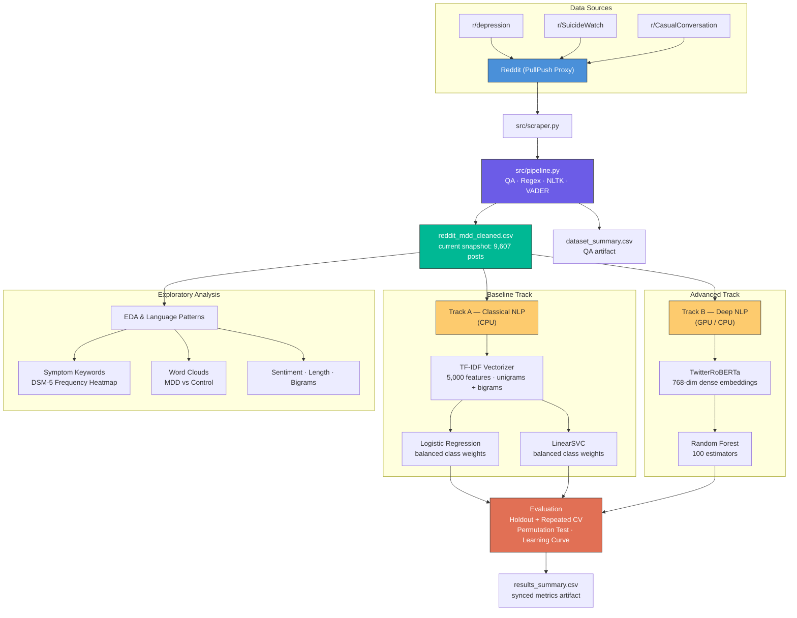

<div align="center">

# Reddit MDD NLP Corpus

**Natural Language Processing of Social Media for Major Depressive Disorder Symptom Identification**

[](https://python.org)
[](https://pytorch.org)
[](https://huggingface.co/cardiffnlp/twitter-roberta-base)
[](https://scikit-learn.org)
[](LICENSE)

*Big Data Analytics (BDA) · 6th Semester · IIIT Allahabad*  
*Domain: HDA-4 · Group: 4*

</div>

---

## Table of Contents

- [Overview](#overview)
- [Repository Status](#repository-status)
- [For Evaluators](#for-evaluators)
- [Key Results](#key-results)
- [Evaluation Design](#evaluation-design)
- [Documentation Map](#documentation-map)
- [Architecture](#architecture)
- [Project Structure](#project-structure)
- [Getting Started](#getting-started)
- [Reproducibility Notes](#reproducibility-notes)
- [Usage](#usage)
- [Dataset](#dataset)
- [Tech Stack](#tech-stack)
- [Limitations](#limitations)
- [Team](#team)
- [Acknowledgements](#acknowledgements)

---

## Overview

This repository contains an end-to-end NLP pipeline for **three-class severity classification of Reddit posts** into `Control`, `Moderate MDD`, and `Severe Ideation`. It combines data acquisition, preprocessing, dataset QA, classical baselines, a transformer feature-extraction track, explainability, and quarterly automation in one reproducible workflow.

The project uses `r/CasualConversation` as a neutral baseline, `r/depression` as a moderate-distress source, and `r/SuicideWatch` as a severe-risk source. The goal is not clinical diagnosis, but defensible academic analysis of symptom and emotional language patterns in large-scale social-media text.

The repository is organized so an evaluator can either inspect the committed artifacts directly or reproduce the full workflow from scraping through model comparison.

### Highlights

- **10,000-post raw extraction target** with a **9,607-row deduplicated processed snapshot**
- Three-class severity framing: `Control`, `Moderate MDD`, `Severe Ideation`
- **Classical NLP:** TF-IDF + Logistic Regression + LinearSVC
- **Deep Representation:** `twitter-roberta-base` + Random Forest
- **Stronger evaluation:** fixed holdout split + 5-fold, 3-repeat repeated cross-validation
- **Dataset QA artifacts:** duplicate removal, `text_hash`, and `dataset_summary.csv`
- **Deployment-ready artifacts:** saved `.joblib` models + metadata for live inference
- **Explainable AI (XAI):** SHAP integration for clinical transparency
- **Comprehensive EDA** — DSM-5 symptom keyword analysis, word clouds, sentiment distributions, post length profiling, bigrams, learning curve, and error analysis
- **Hardware-agnostic** notebook — auto-detects CUDA GPU or falls back to CPU
- **Streamlit dashboard path** for polished live demo inference
- **Automated quarterly refresh** via GitHub Actions CI/CD

---

## Repository Status

| Item | Current State |
|:---|:---|
| **Project maturity** | Final coursework-ready repository with committed evaluation artifacts |
| **Recommended evaluation path** | Google Colab with **T4 GPU** |
| **Primary metrics source** | `data/processed/results_summary.csv` |
| **Live demo path** | `streamlit run app.py` after pulling saved model artifacts |
| **Best repeated-CV model** | `TF-IDF + Logistic Regression` |
| **Best holdout model** | `TF-IDF + Logistic Regression` |
| **QA status** | Duplicate-safe processed snapshot committed with `dataset_summary.csv` |

The repository now includes the final notebook outputs, so an evaluator can inspect the committed artifacts directly without rerunning the full pipeline first.

---

## For Evaluators

If you want the quickest high-signal read of the project, use this order:

1. Read the metrics and artifact summary in this README.
2. Open [`data/processed/results_summary.csv`](data/processed/results_summary.csv) for the committed source-of-truth metrics.
3. Read [`docs/methods_and_results.md`](docs/methods_and_results.md) for methodology, interpretation, and error analysis.
4. Open [`notebooks/02_text_classification_models.ipynb`](notebooks/02_text_classification_models.ipynb) if you want to see the full evaluation pipeline that produced the artifacts.
5. Open [`app.py`](app.py) if you want to inspect the live-inference dashboard entry point.

If you are checking reproducibility, the recommended path is the Colab T4 workflow documented below. If you are checking implementation quality, start with [`src/pipeline.py`](src/pipeline.py), [`src/scraper.py`](src/scraper.py), and [`docs/workflow.md`](docs/workflow.md).

---

## Key Results

The latest Colab T4 run generated synchronized artifacts and the committed metrics below.

### Executive Summary

- **Best overall model:** `TF-IDF + Logistic Regression` led both repeated CV and the fixed holdout split.
- **Dense-model takeaway:** `TwitterRoBERTa + Random Forest` remained competitive, but did not outperform the strongest sparse baseline on the current dataset.
- **Main error pattern:** the hardest confusions were between `Moderate MDD` and `Severe Ideation`, which is consistent with overlapping depressive vocabulary across adjacent severity tiers.
- **Interpretability takeaway:** the exported top tokens align well with label semantics:
  - `Control`: `curious`, `lol`, `coffee`, `chat`
  - `Moderate MDD`: `depression`, `depressed`, `therapy`, `help`
  - `Severe Ideation`: `suicide`, `suicidal`, `die`, `kill`, `attempt`

### Repeated Cross-Validation (5-fold, 3-repeat)

| Model | Accuracy (mean ± std) | Macro F1 (mean ± std) | Weighted F1 (mean ± std) |
|:---|:---:|:---:|:---:|
| **TF-IDF + Logistic Regression** | **0.7762 ± 0.0100** | **0.7251 ± 0.0109** | **0.7747 ± 0.0099** |
| TF-IDF + LinearSVC | 0.7616 ± 0.0077 | 0.7059 ± 0.0096 | 0.7584 ± 0.0082 |
| TwitterRoBERTa + Random Forest | 0.7600 ± 0.0071 | 0.6955 ± 0.0085 | 0.7503 ± 0.0076 |

### Fixed Holdout Split (80/20 Stratified)

| Model | Accuracy | Macro F1 | Severe Precision | Severe Recall |
|:---|:---:|:---:|:---:|:---:|
| **TF-IDF + Logistic Regression** | **0.7841** | **0.7355** | **0.6721** | **0.6340** |
| TF-IDF + LinearSVC | 0.7700 | 0.7175 | 0.6651 | 0.6231 |
| TwitterRoBERTa + Random Forest | 0.7596 | 0.6969 | 0.6684 | 0.5534 |

- **Permutation test:** the main TF-IDF baseline reached macro F1 `0.7221` with `p = 0.032258`, supporting performance above chance at the 5% level.
- **Dataset QA snapshot:** `9,800` rows before QA, `9,607` after QA, with `145` duplicate `post_id` rows and `48` exact duplicate `title+selftext` rows removed.

### Artifact Outputs

| Artifact | Purpose |
|:---|:---|
| `data/processed/dataset_summary.csv` | QA summary: row counts, duplicate removals, label counts, length stats, and date range |
| `data/processed/results_summary.csv` | Repeated-CV metrics, holdout metrics, and permutation-test result |
| `data/processed/error_analysis_holdout.csv` | Representative misclassifications from the holdout split |
| `data/processed/top_tokens_by_class.csv` | Top sparse-model tokens exported for interpretation |

### Deployment Artifacts

| Artifact | Purpose |
|:---|:---|
| `models/tfidf_logreg_pipeline.joblib` | Default live inference model for the Streamlit dashboard |
| `models/tfidf_linearsvc_pipeline.joblib` | Secondary sparse baseline available for model switching |
| `models/roberta_rf_classifier.joblib` | Saved dense-classifier head for runtime TwitterRoBERTa inference |
| `models/model_metadata.json` | Dashboard metadata, default model, benchmark snapshots, and artifact registry |
| `models/class_labels.json` | Stable label ordering and numeric mapping for live inference |

> **Source of truth:** after each notebook run, the latest metrics should be taken from `results_summary.csv`, not from hard-coded markdown tables.

### EDA and Language Pattern Detection

Six exploratory analyses were conducted to detect symptom and emotional language patterns across the three labels:

| Analysis | Key Insight |
|:---|:---|
| **DSM-5 Symptom Keywords** | Distress-related classes show much higher symptom-keyword density than Control; severe-tier language is especially rich in ideation terms |
| **Word Clouds** | Control vocabulary is casual and conversational; Moderate MDD and Severe Ideation are much more distress-oriented |
| **Sentiment Distribution** | Moderate and Severe classes shift clearly toward negative VADER sentiment, with Severe Ideation most concentrated in the negative range |
| **Post Length** | Distress-related posts are generally longer, consistent with rumination-heavy self-expression |
| **Top Bigrams** | Control reflects everyday discussion; Moderate and Severe classes surface more emotionally loaded phrases |
| **XAI (SHAP)** | Token-level explanations make the strongest class cues explicit and auditable |

Full analysis → [`docs/methods_and_results.md`](docs/methods_and_results.md)

---

## Evaluation Design

The project was intentionally structured to make the reported results easier to defend in a coursework setting.

| Design Choice | Why It Matters |
|:---|:---|
| **QA before modeling** | Removes duplicate `post_id` rows and exact duplicate `title+selftext` pairs before evaluation |
| **Deterministic `text_hash`** | Preserves an audit trail for leakage-aware downstream analysis |
| **Shared comparison protocol** | Logistic Regression, LinearSVC, and TwitterRoBERTa + Random Forest are all compared on the same processed dataset and label mapping |
| **Fixed 80/20 holdout** | Produces a stable confusion-matrix view for the report/demo |
| **5-fold, 3-repeat CV** | Reduces dependence on a single split and supports mean ± std reporting |
| **Permutation test** | Adds evidence that the main baseline performs above chance |
| **Learning curve** | Helps justify whether more quarterly data is likely to improve performance |
| **Error analysis + SHAP** | Moves the project beyond metric reporting into interpretable model behavior |

In practice, this means the project is not just a notebook with a single accuracy number. It is a small but complete experimentation pipeline with QA, repeatable evaluation, artifact export, and interpretable outputs.

---

## Documentation Map

| File | Role |
|:---|:---|
| [`docs/Context.md`](docs/Context.md) | Living project context, decisions log, and current committed snapshot |
| [`docs/workflow.md`](docs/workflow.md) | End-to-end data and modeling pipeline description |
| [`docs/methods_and_results.md`](docs/methods_and_results.md) | Final evaluation narrative, methodology, and interpretation |
| [`docs/team_work_division.md`](docs/team_work_division.md) | Viva/demo cheat sheet by contributor |
| [`data/processed/results_summary.csv`](data/processed/results_summary.csv) | Latest committed metrics export |
| [`app.py`](app.py) | Streamlit dashboard entry point for live inference |

---

## Architecture



---

## Project Structure

```
BDA-MDD-Reddit-NLP/
│
├── data/
│   ├── raw/                                  # Raw scraped CSVs
│   └── processed/                            # Cleaned & labeled dataset + QA/eval artifacts
│       ├── reddit_mdd_cleaned.csv
│       ├── dataset_summary.csv
│       ├── results_summary.csv
│       ├── error_analysis_holdout.csv
│       └── top_tokens_by_class.csv
│
├── models/                                   # Saved deployment artifacts for live inference
│   ├── tfidf_logreg_pipeline.joblib
│   ├── tfidf_linearsvc_pipeline.joblib
│   ├── roberta_rf_classifier.joblib
│   ├── model_metadata.json
│   └── class_labels.json
│
├── notebooks/
│   ├── Assignment_1_PRAW_Extraction.ipynb    # Legacy notebook from the original PRAW plan
│   └── 02_text_classification_models.ipynb   # QA, ML comparison, CV, SHAP, EDA, and model export
│
├── src/
│   ├── scraper.py                            # PullPush API client
│   ├── pipeline.py                           # End-to-end extraction + cleaning
│   ├── inference.py                          # Shared model loading and prediction logic
│   ├── dashboard_utils.py                    # Streamlit styling and chart helpers
│   └── quarterly_updater.py                  # Local 90-day refresh fallback
│
├── docs/
│   ├── assignments/
│   │   └── Our_Project_Task.md               # Original grading rubric
│   ├── assets/                               # Reference PDFs & briefs
│   ├── Context.md                            # Living project context document
│   ├── methods_and_results.md                # Evaluation report
│   ├── workflow.md                           # Data pipeline documentation
│   └── team_work_division.md                 # Group work allocation cheat sheet
│
├── .env.example                              # Environment variable template
├── .gitignore
├── app.py                                    # Streamlit live inference dashboard
├── README.md                                 # ← You are here
└── requirements.txt                          # Python dependencies
```

---

## Getting Started

### Prerequisites

| Requirement | Version |
|:---|:---|
| Python | 3.12+ |
| pip | Latest |
| Git | 2.x |
| *(Optional)* NVIDIA GPU + CUDA | For accelerated BERT inference |

### Installation

```bash
# 1. Clone the repository
git clone https://github.com/Krishna200608/BDA-MDD-Reddit-NLP.git
cd BDA-MDD-Reddit-NLP

# 2. Create and activate a virtual environment
python -m venv .venv
source .venv/bin/activate      # macOS / Linux
.venv\Scripts\activate         # Windows

# 3. Install dependencies
pip install -r requirements.txt
```

> The saved `.joblib` inference artifacts were exported with `scikit-learn==1.6.1`, so the requirements file pins that version for local dashboard compatibility.

---

## Reproducibility Notes

| Scenario | Recommended Path | Notes |
|:---|:---|:---|
| **Official coursework reproduction** | Google Colab + **T4 GPU** | Uses the full processed dataset and the intended dense-model evaluation path |
| **Fast local inspection** | Open the committed CSV artifacts directly | No rerun required |
| **Local notebook experimentation** | Run the notebook on CPU | Dense-model path automatically uses a smaller fallback sample |
| **Live dashboard demo** | Pull repo after Colab export, then run `streamlit run app.py` | Requires saved artifacts under `models/` |
| **Dataset refresh** | `python src/pipeline.py` or GitHub Actions | Regenerates the cleaned dataset and QA summary |

### Expected Outputs From A Successful Full Run

The final notebook run should leave the repository with these artifacts under `data/processed/`:

- `dataset_summary.csv`
- `results_summary.csv`
- `error_analysis_holdout.csv`
- `top_tokens_by_class.csv`

The final deployment-export step should also leave these artifacts under `models/`:

- `tfidf_logreg_pipeline.joblib`
- `tfidf_linearsvc_pipeline.joblib`
- `roberta_rf_classifier.joblib`
- `model_metadata.json`
- `class_labels.json`

For reporting and documentation, `results_summary.csv` should always be treated as the primary metrics source.

---

## Usage

### Recommended Path By Goal

| Goal | Recommended Entry Point |
|:---|:---|
| Reproduce the final evaluation | `notebooks/02_text_classification_models.ipynb` on Colab T4 |
| Refresh the dataset | `python src/pipeline.py` |
| Inspect the final committed metrics | `data/processed/results_summary.csv` |
| Demo live inference | `streamlit run app.py` |
| Review the methodology | `docs/methods_and_results.md` and `docs/workflow.md` |

### Assignment 1 — Data Extraction Pipeline

Run the complete scraping and preprocessing pipeline locally:

```bash
python src/pipeline.py
```

This will:
1. Attempt to scrape 10,000 posts via the PullPush proxy API
2. Deduplicate by `post_id` and exact `title+selftext`
3. Create a deterministic `text_hash` for leakage-aware downstream analysis
4. Clean text (regex, stopword removal, lowercasing)
5. Drop posts with fewer than 5 cleaned words and compute VADER sentiment scores
6. Export `data/raw/reddit_raw.csv`, `data/processed/reddit_mdd_cleaned.csv`, and `data/processed/dataset_summary.csv`

### Assignment 2 — Text Classification Models

#### Option A: Google Colab *(Recommended)*

1. Open [`notebooks/02_text_classification_models.ipynb`](notebooks/02_text_classification_models.ipynb) in Google Colab
2. Set runtime to **T4 GPU** via *Runtime > Change runtime type > T4 GPU*
3. Run the first setup cell. It now:
   - clones the repo automatically,
   - installs the notebook-only Colab dependencies,
   - detects whether a CUDA GPU is available,
   - and keeps the full processed dataset for the official TwitterRoBERTa evaluation path.
4. Add a Colab Secret named `GITHUB_TOKEN` if you want authenticated clone/push from Colab
5. Run all cells
6. The notebook now saves deployment-ready `.joblib` and JSON model artifacts under `models/`
7. The final sync cell now stages and pushes the full Colab repo state by default when `GITHUB_TOKEN` is present; you can disable that by setting `AUTO_PUSH_CHANGES = False`

**Expected outputs from the notebook run:**
- `data/processed/results_summary.csv`
- `data/processed/error_analysis_holdout.csv`
- `data/processed/top_tokens_by_class.csv`
- `models/tfidf_logreg_pipeline.joblib`
- `models/tfidf_linearsvc_pipeline.joblib`
- `models/roberta_rf_classifier.joblib`
- `models/model_metadata.json`
- `models/class_labels.json`

#### Option B: Local Execution

Simply open the notebook locally. The hardware-detection logic will:
- Automatically fall back to CPU
- Subsample the dataset to **2,000 rows** for faster processing

The upgraded notebook also exports:
- `data/processed/results_summary.csv`
- `data/processed/error_analysis_holdout.csv`
- `data/processed/top_tokens_by_class.csv`
- `models/*.joblib`
- `models/*.json`

### Streamlit Dashboard

After rerunning the notebook in Colab and pulling the saved model artifacts locally, launch the live inference dashboard with:

```bash
streamlit run app.py
```

The dashboard is designed for a polished, clinical-grade classroom demo:
- **NeuroFetal-AI Inspired UI:** Dark sidebar UI with a bright card-based main canvas and an identical custom-built dark mode pill-toggle button. 
- **Responsive Layouts:** Full integration of auto-scaling, margin-aware Plotly charts replacing static tables.
- **Model Switching:** Instantly swap across the saved inference artifacts via the dropdown.
- **Explainable AI (XAI):** Lightweight runtime SHAP explainability for sparse models via Plotly `probability_charts` and `explanation_charts`.
- **Dynamic Session State:** Correctly triggers interface reruns via `st.session_state` when loading new clinical text samples or interacting with the dark mode switch.

### Quarterly Automation (CI/CD)

The dataset is **automatically refreshed every quarter** via a GitHub Actions workflow — no local machine needed.

| Property | Value |
|:---|:---|
| **Schedule** | 1st of Jan, Apr, Jul, Oct (00:00 UTC) |
| **Trigger** | Cron schedule + manual `workflow_dispatch` |
| **Workflow File** | [`.github/workflows/quarterly_update.yml`](.github/workflows/quarterly_update.yml) |

The workflow checks out the repo, runs `src/pipeline.py` on a GitHub-hosted runner, and commits the refreshed CSV back to `data/`.

> **Manual trigger:** Go to *Actions → Quarterly Dataset Update → Run workflow* to refresh on demand.

<details>
<summary>Local fallback (optional)</summary>

If you prefer running locally, a standalone daemon script is also available:

```bash
python src/quarterly_updater.py
```

This uses the [`schedule`](https://pypi.org/project/schedule/) library and runs persistently in the foreground. Terminate with `Ctrl+C`.

</details>

---

## Dataset

| Property | Value |
|:---|:---|
| **Current Committed Snapshot** | 9,607 deduplicated processed rows |
| **Label Distribution** | `Control` 4,903 · `Moderate MDD` 2,408 · `Severe Ideation` 2,296 |
| **Raw Extraction Target** | `r/depression` 2,500 · `r/SuicideWatch` 2,500 · `r/CasualConversation` 5,000 |
| **Features** | `post_id`, `subreddit`, `timestamp`, `title`, `selftext`, `score`, `num_comments`, `author`, `label`, `selftext_cleaned`, `word_count`, `sentiment_score`, `text_hash` |
| **QA Artifact** | `data/processed/dataset_summary.csv` |
| **Source** | [PullPush.io](https://pullpush.io) (Pushshift proxy) |
| **Evaluation Protocol** | Fixed 80/20 stratified holdout + 5-fold, 3-repeat repeated CV |
| **Date Range** | `2025-03-05T06:40:41` → `2025-05-19T18:11:58` |

---

## Tech Stack

| Layer | Technology |
|:---|:---|
| **Language** | Python 3.12+ |
| **Data** | pandas · NumPy |
| **NLP** | NLTK · regex · VADER Sentiment · wordcloud |
| **Embeddings** | [TwitterRoBERTa](https://huggingface.co/cardiffnlp/twitter-roberta-base) (HuggingFace Transformers) |
| **ML** | scikit-learn (Logistic Regression, LinearSVC, Random Forest, TF-IDF) |
| **Deep Learning** | PyTorch (CUDA / CPU) |
| **Deployment / UI** | Streamlit · Plotly · joblib |
| **Automation** | GitHub Actions CI/CD + `schedule` fallback |
| **Environment** | venv · pip |
| **Version Control** | Git + GitHub |

---

## Limitations

- **Proxy labels only:** subreddit origin is used as a practical course-project label, not a medical diagnosis.
- **Self-report is noisy:** posts can mix severity cues, which especially affects Moderate MDD vs Severe Ideation.
- **Academic use only:** this project supports coursework, NLP experimentation, and comparative evaluation, not clinical screening or deployment.
- **Privacy and ethics matter:** the source text comes from sensitive mental-health contexts and should be handled carefully in demos and reports.
- **Transformer fallback mode:** local CPU runs use a 2,000-row sample for practicality; GPU/Colab remains the preferred path for official dense-model evaluation.
- **Dashboard caution:** the Streamlit app is a live classroom demo interface for saved academic models, not a healthcare decision-support tool.

---

## Team

| Name | Roll Number |
|:---|:---|
| **Krishna Sikheriya** | IIT2023139 |
| **Priyam Jyoti Chakrabarty** | IIT2023147 |
| **Tavish Chawla** | IIT2023150 |

**Instructor:** Prof. Sonali Agarwal  
**Institution:** Indian Institute of Information Technology, Allahabad (IIIT-A)

---

## Acknowledgements

- [cardiffnlp/twitter-roberta-base](https://huggingface.co/cardiffnlp/twitter-roberta-base) — Social-media transformer used for dense embedding experiments
- [VADER Sentiment Analysis](https://github.com/cjhutto/vaderSentiment) — Lexicon-based sentiment scoring
- [PullPush.io](https://pullpush.io) — Pushshift API proxy for historical Reddit data
- [scikit-learn](https://scikit-learn.org/) — Machine learning framework
- [HuggingFace Transformers](https://huggingface.co/docs/transformers) — Transformer model ecosystem

---

<div align="center">

*Big Data Analytics — IIIT Allahabad, 2026*

</div>
